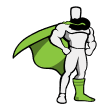

<h2 align="center">Hi there 👋, I am Utttam and I am a full stack developer.</h2>
<h3 align="center">I started as a frontend developer and with time I have ventured towards backend technologies in my three years of experience.</h3>

- 🔭 I’m currently working on [FoodHub-Admin Panel](https://github.com/UttamMarandi/AdminPanel-FoodHub)

- 🌱 I’m currently learning Backend technologies like **AWS, Docker and Jenkins.**

- 👨‍💻 All of my projects are available at [my portfolio](https://uttam-marandi-portfolio.vercel.app/)

- 📝 I try to regularly write articles on [dev.to](https://dev.to/uttammarandi)

- 💬 I have vivid experience in **react, nextjs, wordpress, nodejs and mongodb.**

- 📫 You can reach me using my mail **uttammarandi007@gmail.com**

- 📄 My Resume [Uttam Marandi Resume](https://drive.google.com/file/d/1n4sV-OVe3569wfjGk9d20Nn3wv88O51I/view?usp=sharing)

<h3 align="left">Connect with me:</h3>

<h3 align="left">Technologies:</h3>
<h4 align="left">Frontend:</h4>

         

<h4 align="left">Backend:</h4>
       
   
 
 
<h4 align="left">Testing & Documentation:</h4>
      
 
 <h4 align="left">Design:</h4>
    

&nbsp;

